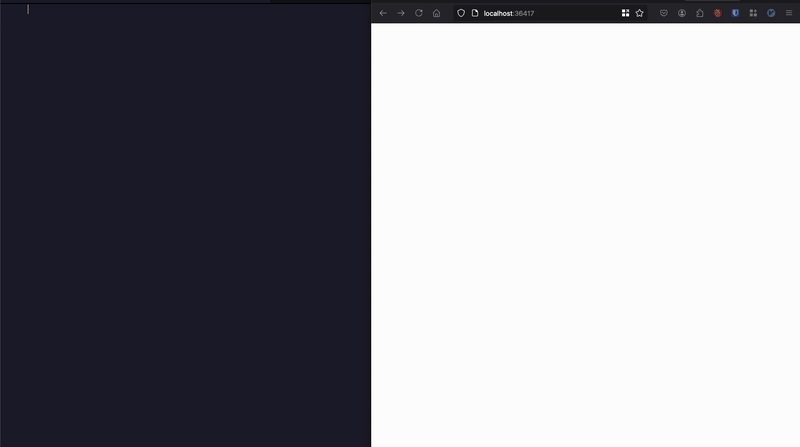

# Markdown Preview Language Server

[](https://opensource.org/licenses/Apache-2.0)
[](https://goreportcard.com/report/github.com/mhersson/mpls)

Built using [GLSP](https://github.com/tliron/glsp) and
[Goldmark](https://github.com/yuin/goldmark), and heavily inspired by
[mdpls](https://github.com/euclio/mdpls)

## Overview

Markdown Preview Language Server (`mpls`) is a language server designed to
enhance your Markdown editing experience. With live preview in the browser,
`mpls` allows you to see your Markdown content rendered in real-time. Whether
you're writing documentation or creating notes, `mpls` provides a seamless and
interactive environment.

Built with terminal editors in mind, such as (Neo)vim and Helix, which do not
have built-in Markdown rendering, `mpls` bridges the gap by providing a live
preview feature that works alongside these editors. Additionally, `mpls` is
compatible with any editor that supports the Language Server Protocol (LSP),
making it a versatile tool for Markdown editing across various platforms. For
users of Visual Studio Code, there is also a dedicated extension available at
[mpls-vscode-client](https://github.com/mhersson/mpls-vscode-client),



## Features

- Live Preview: Instantly see your Markdown changes reflected in the browser.
- Theme toggle for switching between light and dark mode.

### Built with Goldmark

`mpls` is built using [Goldmark](https://github.com/yuin/goldmark), a Markdown
parser written in Go. Goldmark is known for its extensibility and performance,
making it an ideal choice for `mpls`.

#### Goldmark extensions

`mpls` utilizes several of Goldmark's extensions to enhance the Markdown
rendering experience:

**Always enabled**

- Github Flavored Markdown: Goldmark's built in GFM extension ensures Table,
  Strikethrough, Linkify and TaskList elements are displayed correctly.
- Image Rendering: The [img64](https://github.com/tenkoh/goldmark-img64)
  extension allows for seamless integration of images within your Markdown
  files.
- Math Rendering: The [katex](https://github.com/FurqanSoftware/goldmark-katex)
  extension enables the rendering of LaTeX-style mathematical expressions using
  KaTeX. _Please note that the KaTeX extension requires `cgo` and will only be
  included if `mpls` is built with `CGO_ENABLED=1`. This option is not enabled
  for the prebuilt binaries._
- Metadata: The [meta](https://github.com/yuin/goldmark-meta) extension parses
  metadata in YAML format.
- Syntax highlighting: The
  [highlighting](https://github.com/yuin/goldmark-highlighting) extension adds
  syntax-highlighting to the fenced code blocks.

**Optional**

- Emoji: The [emoji](https://github.com/yuin/goldmark-emoji) extension enables
  emoji support.
- Footnotes: The
  [footnote](https://michelf.ca/projects/php-markdown/extra/#footnotes)
  extension enables footnotes.
- Wikilinks rendering: The
  [wikilink](https://github.com/abhinav/goldmark-wikilink) extension enables
  parsing and rendering of [[wiki]] -style links. (_Note:_ image preview does
  not work for wikilinks)

If you want a new Goldmark extension added to `mpls` please look
[here](https://github.com/mhersson/mpls/issues/4).

### Mermaid

`mpls` supports the display of diagrams and flowcharts by integrating
[Mermaid.js](https://mermaid.js.org/), a powerful JavaScript library for
generating diagrams from text definitions.

### PlantUML

`mpls` supports [PlantUML](https://plantuml.com/), a powerful tool for creating
UML diagrams from plain text descriptions. This integration allows you to easily
embed PlantUML code in your markdown files. Diagrams are rendered upon saving
and only if the UML code has changed.

_Please note that external HTTP calls are made only when UML code is present in
the markdown and has changed, as well as when a file is opened. For users
concerned about security, you can host a PlantUML server locally and specify the
`--plantuml-server` flag to ensure that no external calls are made._

## Install

The easiest way to install `mpls` is to download one of the prebuilt release
binaries. You can find the latest releases on the
[Releases page](https://github.com/mhersson/mpls/releases).

1. Download the appropriate tar.gz file for your operating system.
2. Extract the contents of the tar.gz file. You can do this using the following
   command in your terminal:

   ```bash
   tar -xzf mpls_<version>_linux_amd64.tar.gz
   ```

   (Replace `<version>` with the actual version of the release.)

3. Copy the extracted binary to a directory that is in your system's PATH. For
   example:

   ```bash
   sudo cp mpls /usr/local/bin/
   ```

<details>
<summary>Build From Source</summary>

If you prefer to build from source, if you want the KaTeX math extension, or if
no prebuilt binaries are available for your architecture, follow these steps:

1. **Clone the repository**:

   ```bash
   git clone https://github.com/mhersson/mpls.git
   cd mpls
   ```

2. **Build the project**:

   You can build the project using the following command:

   _To include the math extension, you need to set `CGO_ENABLED=1` before
   running this command:_

   ```bash
   make build
   ```

   This command will compile the source code and create an executable.

3. **Install the executable**:

   You have two options to install the executable:

   - **Option 1: Copy the executable to your PATH**:

     After building, you can manually copy the executable to a directory that is
     in your system's PATH. For example:

     ```bash
     sudo cp mpls /usr/local/bin/
     ```

   - **Option 2: Use `make install` if you are using GOPATH**:

     If the GOPATH is in your PATH, you can run:

     ```bash
     make install
     ```

     This will install the executable to your `$GOPATH/bin` directory.

</details>

**Verify the installation**:

After installation, you can verify that `mpls` is installed correctly by
running:

```bash
mpls --version
```

This should display the version of the `mpls` executable.

## Command-Line Options

The following options can be used when starting `mpls`:

| Flag                     | Description                                                           |
| ------------------------ | --------------------------------------------------------------------- |
| `--browser`              | Specify web browser to use for the preview. **(1)**                   |
| `--code-style`           | Sets the style for syntax highlighting in fenced code blocks. **(2)** |
| `--dark-mode`            | Enable dark mode                                                      |
| `--enable-emoji`         | Enable emoji support                                                  |
| `--enable-footnotes`     | Enable footnotes                                                      |
| `--enable-wikilinks`     | Enable rendering of [[wiki]] -style links                             |
| `--full-sync`            | Sync the entire document for every change being made. **(3)**         |
| `--no-auto`              | Don't open preview automatically                                      |
| `--plantuml-disable-tls` | Disable encryption on requests to the PlantUML server                 |
| `--plantuml-server`      | Specify the host for the PlantUML server                              |
| `--plantuml-path`        | Specify the base path for the PlantUML server                         |
| `--port`                 | Set a fixed port for the preview server                               |
| `--version`              | Displays the mpls version.                                            |
| `--help`                 | Displays help information about the available options.                |

1. On Linux specify executable e.g "firefox" or "google-chrome", on MacOS name
   of Application e.g "Safari" or "Microsoft Edge", on Windows use full path. On
   WSL, specify the executable as "explorer.exe" to start the default Windows
   browser.
2. The goldmark-highlighting extension use
   [Chroma](https://github.com/alecthomas/chroma) as the syntax highlighter, so
   all available styles in Chroma are available here. Default style is
   `catppuccin-mocha`.
3. Has a small impact on performance, but makes sure that commands like `reflow`
   in Helix, does not impact the accuracy of the preview. Additionally, it
   disables `mpls'` efforts to scroll to the closest section header when
   editing.

## Configuration examples

**Helix**

<details>
<summary>languages.toml</summary>

```toml
# Configured to run alongside marksman.
[[language]]
auto-format = true
language-servers = ["marksman", "mpls"]
name = "markdown"

[language-server.mpls]
command = "mpls"
args = ["--enable-emoji"]
# An example args entry showing how to specify flags with values:
# args = ["--port", "8080", "--browser", "google-chrome"]
```

</details>

**Neovim (LazyVim)**

<details>
<summary>lua/plugins/mpls.lua</summary>

```lua
return {
  {
    "neovim/nvim-lspconfig",
    opts = {
      servers = {
        mpls = {},
      },
      setup = {
        mpls = function(_, opts)
          local lspconfig = require("lspconfig")
          local configs = require("lspconfig.configs")

          if not configs.mpls then
            configs.mpls = {
              default_config = {
                cmd = { "mpls", "--enable-emoji" },
                filetypes = { "markdown" },
                single_file_support = true,
                root_dir = function(startpath)
                  local git_root = vim.fs.find(".git", { path = startpath or
                    vim.fn.getcwd(), upward = true })
                  return git_root[1] and vim.fs.dirname(git_root[1]) or startpath
                end,
                settings = {},
              },
              docs = {
                description = [[https://github.com/mhersson/mpls

Markdown Preview Language Server (MPLS) is a language server that provides
live preview of markdown files in your browser while you edit them in your favorite editor.
                ]],
              },
            }
          end
          lspconfig.mpls.setup(opts)
          vim.api.nvim_create_user_command('MplsOpenPreview', function()
            local clients = vim.lsp.get_active_clients()
            local mpls_client = nil

            for _, client in ipairs(clients) do
              if client.name == "mpls" then
                mpls_client = client
                break
              end
            end

            -- Only execute the command if the MPLS client is found
            if mpls_client then
              local params = {
                command = 'open-preview',
                arguments = {}
              }
              mpls_client.request('workspace/executeCommand', params,
                function(err, result)
                if err then
                  print("Error executing command: " .. err.message)
                end
              end)
            else
              print("mpls is not attached to the current buffer.")
            end
          end, {})
        end,
      },
    },
  },
}
```

</details>

**Doom-Emacs with lsp-mode**

<details>
<summary>config.el</summary>

```elisp
(after! markdown-mode
  ;; Auto start
  (add-hook 'markdown-mode-local-vars-hook #'lsp!))

(after! lsp-mode
  (defgroup lsp-mpls nil
    "Settings for the mpls language server client."
    :group 'lsp-mode
    :link '(url-link "https://github.com/mhersson/mpls"))

  (defun lsp-mpls-open-preview ()
    "Open preview of current buffer"
    (interactive)
    (lsp-request
     "workspace/executeCommand"
     (list :command "open-preview")))

  (defcustom mpls-server-command "mpls"
    "The binary (or full path to binary) which executes the server."
    :type 'string
    :group 'lsp-mpls)

  (lsp-register-client
  (make-lsp-client :new-connection (lsp-stdio-connection
                                     (lambda ()
                                       (list
                                        (or (executable-find lsp-mpls-server-command)
                                            (lsp-package-path 'mpls)
                                            "mpls")
                                        "--enable-emoji"
                                        )))
                    :activation-fn (lsp-activate-on "markdown")
                    :initialized-fn (lambda (workspace)
                                      (with-lsp-workspace workspace
                                                          (lsp--set-configuration
                                                          (lsp-configuration-section "mpls"))
                                                          ))
                    ;; Priority and add-on? are not needed,
                    ;; but makes mpls work alongside other lsp servers like marksman
                    :priority 1
                    :add-on? t
                    :server-id 'mpls)))

```

</details>
