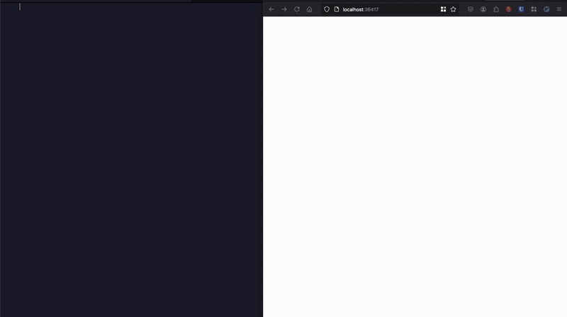

# Markdown Preview Language Server

[](https://opensource.org/licenses/Apache-2.0)
[](https://goreportcard.com/report/github.com/mhersson/mpls)
[](https://github.com/mhersson/vectorsigma/mpls)

Built using [GLSP](https://github.com/tliron/glsp) and
[Goldmark](https://github.com/yuin/goldmark), and heavily inspired by
[mdpls](https://github.com/euclio/mdpls)

## Overview

Markdown Preview Language Server (`mpls`) is a language server designed to
enhance your Markdown editing experience. With live preview in the browser,
`mpls` allows you to see your Markdown content rendered in real-time. Whether
you're writing documentation or creating notes, `mpls` provides a seamless and
interactive environment.

Built with terminal editors in mind, such as (Neo)vim and Helix, which do not
have built-in Markdown rendering, `mpls` bridges the gap by providing a live
preview feature that works alongside these editors. Additionally, `mpls` is
compatible with any editor that supports the Language Server Protocol (LSP),
making it a versatile tool for Markdown editing across various platforms. For
users of Visual Studio Code and Zed, there are also dedicated extensions
available at
[mpls-vscode-client](https://github.com/mhersson/mpls-vscode-client) and
[mpls for Zed](https://zed.dev/extensions/mpls),



## Features

- **Live Preview**: Instantly see your Markdown changes reflected in the
  browser.
- **Project Awareness**: Multi-file support with workspace/project awareness.
  Switch between markdown files in your editor and the preview updates
  automatically. _Note: Automatic preview updates on editor focus change require
  the editor to send custom LSP notifications. This works in Neovim and Emacs
  (see configuration examples below), but is not currently supported in Helix as
  it cannot send custom events to LSP servers._
- **Interactive Link Navigation**: Click on markdown links in the preview to
  open the linked file in your editor. Navigate your documentation seamlessly
  between browser and editor.
- **Flexible Preview Modes**:
  - **Single-page mode (default)**: All files update in the same browser window,
    perfect for focused editing.
  - **Multi-tab mode** (`--tabs`): Each file opens in its own browser tab for
    side-by-side viewing.
- **Presentation Mode**: Automatically transform your markdown into a slideshow
  presentation, or use explicit markers for full control over slide boundaries
  and layout.
  - Read more in the [presentation mode documentation](presentation-mode.md)

### Built with Goldmark

`mpls` is built using [Goldmark](https://github.com/yuin/goldmark), a Markdown
parser written in Go. Goldmark is known for its extensibility and performance,
making it an ideal choice for `mpls`.

#### Goldmark extensions

`mpls` utilizes several of Goldmark's extensions to enhance the Markdown
rendering experience:

**Always enabled**

- Github Flavored Markdown: Goldmark's built in GFM extension ensures Table,
  Strikethrough, Linkify and TaskList elements are displayed correctly.
- Math Rendering: The [katex](https://github.com/FurqanSoftware/goldmark-katex)
  extension enables the rendering of LaTeX-style mathematical expressions using
  KaTeX. _Please note that the KaTeX extension requires `cgo` and will only be
  included if `mpls` is built with `CGO_ENABLED=1`. This option is not enabled
  for the prebuilt binaries._
- Metadata: The [meta](https://github.com/yuin/goldmark-meta) extension parses
  metadata in YAML format.
- Syntax highlighting: The
  [highlighting](https://github.com/yuin/goldmark-highlighting) extension adds
  syntax-highlighting to the fenced code blocks.
- GitHub-style Alerts: Built-in support for `[!NOTE]`, `[!TIP]`, `[!IMPORTANT]`,
  `[!WARNING]`, and `[!CAUTION]` blockquotes, rendered as styled alert boxes.

**Optional**

- Emoji: The [emoji](https://github.com/yuin/goldmark-emoji) extension enables
  emoji support.
- Footnotes: The
  [footnote](https://michelf.ca/projects/php-markdown/extra/#footnotes)
  extension enables footnotes.
- Wikilinks rendering: The
  [wikilink](https://github.com/abhinav/goldmark-wikilink) extension enables
  parsing and rendering of [[wiki]] -style links. (_Note:_ image preview does
  not work for wikilinks)

If you want a new Goldmark extension added to `mpls` please look
[here](https://github.com/mhersson/mpls/issues/4).

### Mermaid

`mpls` supports the display of diagrams and flowcharts by integrating
[Mermaid.js](https://mermaid.js.org/), a powerful JavaScript library for
generating diagrams from text definitions.

### PlantUML

`mpls` supports [PlantUML](https://plantuml.com/), a powerful tool for creating
UML diagrams from plain text descriptions. This integration allows you to easily
embed PlantUML code in your markdown files. Diagrams are rendered upon saving
and only if the UML code has changed.

> [!NOTE]
>
> _External HTTP calls are made only when UML code is present in the markdown
> and has changed, as well as when a file is opened. For users concerned about
> security, you can host a PlantUML server locally and specify the
> `--plantuml-server` flag to ensure that no external calls are made._

## Install

> [!TIP]
>
> **For Neovim users:** mpls can be installed with
> [mason.nvim](https://github.com/mason-org/mason.nvim)
>
> ```text
> :MasonInstall mpls
> ```

### Homebrew (macOS and Linux)

The easiest way to install and keep `mpls` updated:

```bash
brew tap mhersson/formulas
brew install mpls
```

To update to the latest version:

```bash
brew upgrade mpls
```

### Go Install

If you already have go installed you can just run:

```bash
go install github.com/mhersson/mpls@latest
```

### Prebuilt Binaries

Download one of the prebuilt release binaries from the
[Releases page](https://github.com/mhersson/mpls/releases).

1. Download the appropriate tar.gz file for your operating system.
2. Extract the contents of the tar.gz file. You can do this using the following
   command in your terminal:

   ```bash
   tar -xzf mpls_<version>_linux_amd64.tar.gz
   ```

   (Replace `<version>` with the actual version of the release.)

3. Copy the extracted binary to a directory that is in your system's PATH. For
   example:

   ```bash
   sudo cp mpls /usr/local/bin/
   ```

<details>
<summary>Build From Source</summary>

If you otherwise prefer to build manually from source, if you want the KaTeX
math extension, or if no prebuilt binaries are available for your architecture,
follow these steps:

1. **Clone the repository**:

   ```bash
   git clone https://github.com/mhersson/mpls.git
   cd mpls
   ```

2. **Build the project**:

   You can build the project using the following command:

   _To include the math extension, you need to set `CGO_ENABLED=1` before
   running this command:_

   ```bash
   make build
   ```

   This command will compile the source code and create an executable.

3. **Install the executable**:

   You have two options to install the executable:
   - **Option 1: Copy the executable to your PATH**:

     After building, you can manually copy the executable to a directory that is
     in your system's PATH. For example:

     ```bash
     sudo cp mpls /usr/local/bin/
     ```

   - **Option 2: Use `make install` if you are using GOPATH**:

     If the GOPATH is in your PATH, you can run:

     ```bash
     make install
     ```

     This will install the executable to your `$GOPATH/bin` directory.

</details>

**Verify the installation**:

After installation, you can verify that `mpls` is installed correctly by
running:

```bash
mpls --version
```

This should display the version of the `mpls` executable.

## Command-Line Options

The following options can be used when starting `mpls`:

| Flag                     | Description                                                                      |
| ------------------------ | -------------------------------------------------------------------------------- |
| `--browser`              | Specify web browser to use for the preview. **(1)**                              |
| `--code-style`           | Sets the style for syntax highlighting in fenced code blocks. **(2)**            |
| `--dark-mode`            | **DEPRECATED:** Use `--theme dark` instead. Will be removed in a future release. |
| `--enable-emoji`         | Enable emoji support                                                             |
| `--enable-footnotes`     | Enable footnotes                                                                 |
| `--enable-wikilinks`     | Enable rendering of [[wiki]] -style links                                        |
| `--full-sync`            | Sync the entire document for every change being made. **(3)**                    |
| `--help`                 | Displays help information about the available options.                           |
| `--list-themes`          | List all available themes and exit                                               |
| `--no-auto`              | Don't open preview automatically                                                 |
| `--plantuml-disable-tls` | Disable encryption on requests to the PlantUML server                            |
| `--plantuml-path`        | Specify the base path for the PlantUML server                                    |
| `--plantuml-server`      | Specify the host for the PlantUML server                                         |
| `--port`                 | Set a fixed port for the preview server                                          |
| `--tabs`                 | Enable multi-tab preview mode. Each file opens in its own browser tab. **(4)**   |
| `--theme`                | Set the preview theme (light, dark, or any of the provided themes). **(5)**      |
| `--version`              | Displays the mpls version.                                                       |

1. On Linux specify executable e.g "firefox" or "google-chrome", on MacOS name
   of Application e.g "Safari" or "Microsoft Edge", on Windows use full path. On
   WSL, specify the executable as "explorer.exe" to start the default Windows
   browser.
2. The goldmark-highlighting extension use
   [Chroma](https://github.com/alecthomas/chroma) as the syntax highlighter, so
   all available styles in Chroma are available here. Default style is
   `catppuccin-mocha`. When `--theme` is set, the code style automatically
   matches the theme if a corresponding chroma style exists.
3. Has a small impact on performance, but makes sure that commands like `reflow`
   in Helix, does not impact the accuracy of the preview.
4. By default, all files update in the same browser window (single-page mode).
   With `--tabs`, each file opens in its own browser tab with a unique URL. In
   single-page mode, link clicks update the preview; in multi-tab mode, they
   open new tabs.
5. See the [theme gallery](screenshots/themes/README.md) for screenshots of all
   available themes, or use `--list-themes` to list them. Default is `light`.

## Editor Configuration

**✨Helix**

<details>
<summary>click to expand</summary>

In your `languages.toml`

```toml
# Configured to run alongside marksman.
[[language]]
auto-format = true
language-servers = ["marksman", "mpls"]
name = "markdown"

[language-server.mpls]
command = "mpls"
args = ["--theme", "tokyonight", "--enable-emoji"]
# An example args entry showing how to specify flags with values:
# args = ["--port", "8080", "--browser", "google-chrome", "--theme", "gruvbox-dark"]
```

You can manually open the preview by running the command
`:lsp-workspace-command open-preview` in Helix, and also set up a keybinding for
it in your `config.toml`:

For example, to bind it to `Ctrl-m`:

```toml
[keys.normal]
"C-m" = ":lsp-workspace-command open-preview"
```

</details>

**✨Neovim 0.11+**

<details>

<summary>click to expand</summary>

The [nvim-lspconfig](https://github.com/neovim/nvim-lspconfig) extension is the
easiest way to configure mpls with Neovim. If you prefer not to install the
extension, you can copy the complete configuration shown below manually to
`~/.config/nvim/lsp/mpls.lua` instead. Whichever method you choose, you need to
enable the language server with:

```lua
-- filename: ~/.config/nvim/init.lua
vim.lsp.enable({"mpls"})
```

The nvim-lspconfig provides the following command to start the preview:

```text
:LspMplsOpenPreview
```

**Complete configuration:** (Includes custom args and an optional keybinding)

```lua
-- filename: ~/.config/nvim/lsp/mpls.lua
---@type vim.lsp.Config
return {
    cmd = {
        "mpls",
        "--no-auto",
        "--theme",
        "dark",
        "--enable-emoji",
        "--enable-footnotes",
    },
    root_markers = { ".marksman.toml", ".git" },
    filetypes = { "markdown" },
    on_attach = function(client, bufnr)
        vim.api.nvim_create_autocmd("BufEnter", {
            pattern = { "*.md" },
            group = vim.api.nvim_create_augroup("lspconfig.mpls.focus", { clear = true }),
            callback = function(ctx)
                ---@diagnostic disable-next-line:param-type-mismatch
                client:notify("mpls/editorDidChangeFocus", { uri = ctx.match })
            end,
            desc = "mpls: notify buffer focus changed",
        })
        vim.api.nvim_buf_create_user_command(bufnr, "LspMplsOpenPreview", function()
            client:exec_cmd({
                title = "Preview markdown with mpls",
                command = "open-preview",
            })
        end, { desc = "Preview markdown with mpls" })
        -- Optional keybinding
        vim.keymap.set("n", "<leader>mp", "<cmd>LspMplsOpenPreview<cr>", {
            buffer = bufnr,
            desc = "Markdown Preview",
        })
    end,
}
```

</details>

**✨Doom-Emacs with lsp-mode**

<details>
<summary>click to expand</summary>

In your `config.el`

```elisp
(after! markdown-mode
  ;; Auto start
  (add-hook 'markdown-mode-local-vars-hook #'lsp!))

(after! lsp-mode
  (defgroup lsp-mpls nil
    "Settings for the mpls language server client."
    :group 'lsp-mode
    :link '(url-link "https://github.com/mhersson/mpls"))

  (defun mpls-open-preview ()
    "Open preview of current buffer"
    (interactive)
    (lsp-request
     "workspace/executeCommand"
     (list :command "open-preview")))

  (defcustom lsp-mpls-server-command "mpls"
    "The binary (or full path to binary) which executes the server."
    :type 'string
    :group 'lsp-mpls)

  (lsp-register-client
  (make-lsp-client :new-connection (lsp-stdio-connection
                                     (lambda ()
                                       (list
                                        (or (executable-find lsp-mpls-server-command)
                                            (lsp-package-path 'mpls)
                                            "mpls")
                                        "--theme" "nord"
                                        "--enable-emoji"
                                        )))
                    :activation-fn (lsp-activate-on "markdown")
                    :initialized-fn (lambda (workspace)
                                      (with-lsp-workspace workspace
                                        (lsp--set-configuration
                                        (lsp-configuration-section "mpls"))
                                        ))
                    ;; Priority and add-on? are not needed,
                    ;; but makes mpls work alongside other lsp servers like marksman
                    :priority 1
                    :add-on? t
                    :server-id 'mpls))

  ;; Send mpls/editorDidChangeFocus events
  (defvar last-focused-markdown-buffer nil
    "Tracks the last markdown buffer that had focus.")

  (defun send-markdown-focus-notification ()
    "Send an event when focus changes to a markdown buffer."
    (when (and (eq major-mode 'markdown-mode)
               (not (eq (current-buffer) last-focused-markdown-buffer))
               lsp--buffer-workspaces)
      (setq last-focused-markdown-buffer (current-buffer))

      ;; Get the full file path and convert it to a URI
      (let* ((file-name (buffer-file-name))
             (uri (lsp--path-to-uri file-name)))
        ;; Send notification
        (lsp-notify "mpls/editorDidChangeFocus"
                    (list :uri uri
                          :fileName file-name)))))

  (defun setup-markdown-focus-tracking ()
    "Setup tracking for markdown buffer focus changes."
    (add-hook 'buffer-list-update-hook
              (lambda ()
                (let ((current-window-buffer (window-buffer (selected-window))))
                  (when (and (eq current-window-buffer (current-buffer))
                             (eq major-mode 'markdown-mode)
                             (buffer-file-name))
                    (send-markdown-focus-notification))))))

  ;; Initialize the tracking
  (setup-markdown-focus-tracking))
```

</details>

---

Thank you for reading my entire README! 🎉 If you made it this far, I hope you
decide to try out `mpls` and that it works wonders for your Markdown editing 🙂
If you later have some feedback or want to contribute? Issues and PRs are always
appreciated!
